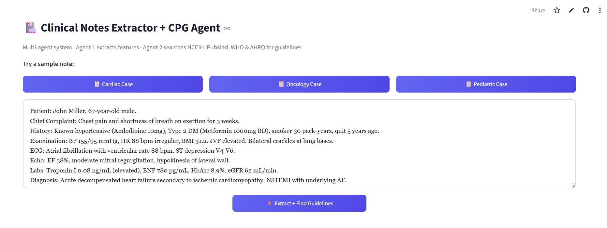
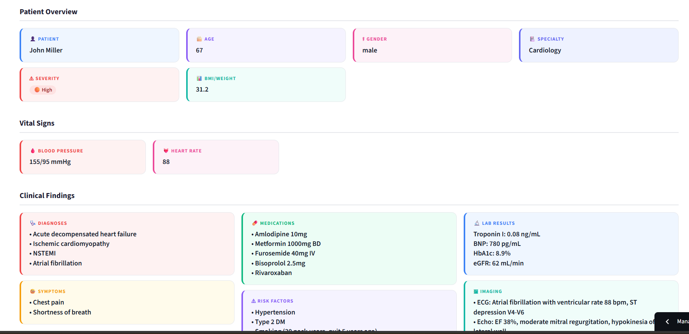
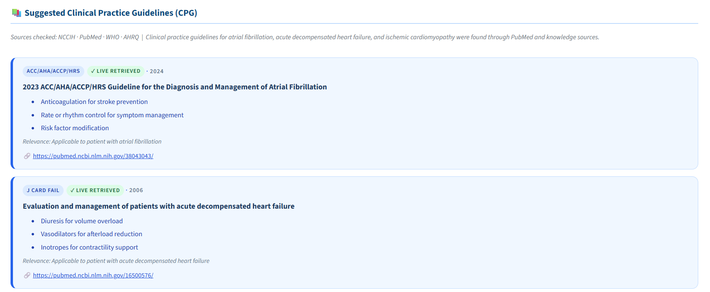

# 🏥 Clinical Notes Extractor + CPG Agent


A multi-agent Streamlit app that turns unstructured clinical notes into structured data and automatically surfaces relevant, evidence-based clinical practice guidelines (CPGs).

**🔗 Live demo:** [cn-fet.streamlit.app](https://cn-fet.streamlit.app/)

---

## Contents

- [How it works](#how-it-works)
- [Screenshots](#screenshots)
- [Features](#features)
- [Tech stack](#tech-stack)
- [Setup](#setup)
- [Deploying to Streamlit Community Cloud](#deploying-to-streamlit-community-cloud)
- [Disclaimer](#disclaimer)

---

## How it works

**Agent 1 — Feature Extractor**
Takes a free-text clinical note and extracts structured fields via an LLM (Groq / Llama 3.3 70B): patient demographics, vitals, diagnoses, symptoms, medications, allergies, lab results, imaging, risk factors, management plan, and severity.

**Agent 2 — CPG Research Agent**
Given the extracted diagnoses and specialty, this agent uses LLM tool-calling to search multiple external sources for relevant clinical guidelines:

- PubMed (E-utilities API)
- NCCIH clinical practice page
- WHO guideline search
- AHRQ guideline search

Results are synthesized into a ranked list of guidelines, each tagged as **live-retrieved** (found via a real search) or **AI-knowledge** (from the model's training data), with organization, key recommendations, and source URL.

---

## Screenshots

### 1. Enter a clinical note
Paste free-text notes or load a ready-made sample case (Cardiac, Oncology, Pediatric).



### 2. Agent 1 — Extracted clinical features
Structured patient overview, vitals, diagnoses, medications, labs, and more.



### 3. Agent 2 — Suggested clinical practice guidelines
Ranked guidelines pulled live from PubMed/NCCIH/WHO/AHRQ, with source links and key recommendations.



---

## Features

- Sample clinical notes (Cardiac, Oncology, Pediatric) for quick demoing
- Real-time agent status while tools are being called
- Clean card-based UI for patient overview, vitals, findings, and plan
- Secrets-based API key management (no keys in code)

## Tech Stack

- [Streamlit](https://streamlit.io/) — UI
- [Groq](https://groq.com/) — LLM inference (Llama 3.3 70B) with function/tool calling
- `requests` + `BeautifulSoup` — guideline scraping
- PubMed E-utilities API

## Setup

1. Clone the repo and install dependencies:
   ```bash
   pip install -r requirements.txt
   ```

2. Add your Groq API key. Create `.streamlit/secrets.toml`:
   ```toml
   GROQ_API_KEY = "gsk_..."
   ```
   (Get a free key at [console.groq.com](https://console.groq.com/keys).)

3. Run the app:
   ```bash
   streamlit run clinical_notes_app_Groq.py
   ```

## Deploying to Streamlit Community Cloud

Set `GROQ_API_KEY` under your app's **Settings → Secrets** instead of committing `secrets.toml` — it's gitignored by default in this repo.

## Disclaimer

This tool is for educational/demo purposes only. It is not a certified medical device and should not be used for real clinical decision-making without validation by qualified healthcare professionals.
